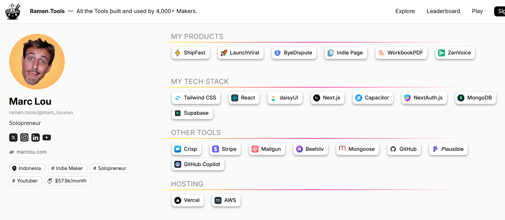

I am thinking what the next steps for the app might be. MAybe in the first place let's summarize what we ahve and what I want it to be. Of course there will be features i dont know about yet.

What can be changed - i think we can make a brainstorm how the design should look because i am not fully satisfied with it right now. it looks good but always can look even better. we need to make a research what's the best practices for sites like this and scan the internet what we can improve.

Next thing is that I want to run backend and frontend with one command. we need to make a research and find out if there is any other solutions than that which we have right now. :Maybe use pnpm or something

we need to add furgotnetka api for sure.

this file will be made to make a plan and tasks and these tasks wil be created as an issues on github, we will make branch for every bigger feature, but it needs to be decided together, if for small changes

we need to automate order workflow somehow. Let's analyze how it loks now, how others do this. I thjink it sdhould be automated 100%. Emails should be seny to the cusotmer after creating the order and also we should have some dashboard that can be reached from anywhere, which will allow us to update status of the order and update client side also

that's all that comes to my mind now, but we need to find out what else can be added to make myy site based on best practices. we should do a big brainstorming session to tackle all of it

i am also thinking about adding some analytics, i mean probably i will have payments analytics on strip, but some traffic done on 

This is stack from youtuber i follow. It looks easy and nice and it would be good to use it for all the data aply it for all my apps and not change it too ofter. For AI i use Claude for now and let's stick it for some time. maybe i will try codex in future

Maybe use skill /grill-me to find out more inforamtion how we should handle design, plan, next steps of sznyt design

https://newsletter.marclou.com/p/the-tech-stack-i-use-to-make-usd-52600-month